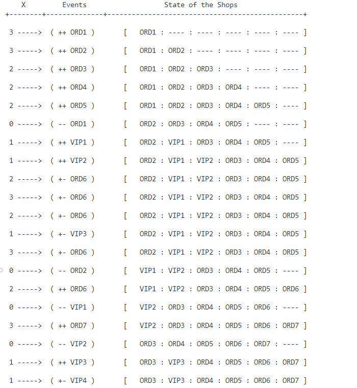
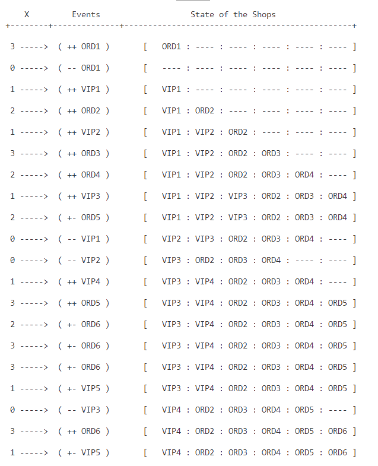

# Barbering Shop Simulation

Welcome to the Barbering Shop Simulation project! This Java program simulates the operations of a barbering shop, where customers (both ordinary and VIP) come in, get their hair trimmed, and leave the shop.

## Description

The Barbering Shop Simulation project is a console-based Java application that simulates the operation of a barbering shop according to certain rules. The program keeps track of the state of the shop, including the main chair for hair trimming and the waiting chairs for customers. It handles the arrival and departure of customers and ensures that the seating arrangement follows specific rules.

## Features

- Random generation of events (arrival of customers, completion of hair trimming, etc.).
- Proper seating of customers according to their type (ORD or VIP) and availability of chairs.
- Display of the state of the shop after each event.
- Simulation of customers leaving the shop after getting their hair trimmed.

## How to Use

1. Clone the repository to your local machine.
2. Open the project in your favorite Java IDE.
3. Compile and run the `Main` class.
4. Press the space bar to trigger an event in the simulation.
5. View the console output to see the state of the shop after each event.
6. Repeat step 4 until you're satisfied with the simulation.
7. Press any key other than space bar to stop the simulation.

## Rules

### The simulation follows the following rules

- Clients occupy the main chair upon arrival if it's available; otherwise, they take a waiting chair.

- Clients wait in order of arrival, provided there are available chairs.
- Clients unable to find a chair must return later.

- VIP clients take priority for the main chair if available, displacing ordinary clients in the waiting queue.

- VIP clients maintain their arrival order in the waiting queue.

- After each hair trimming, the client in the first waiting chair replaces the main chair occupant, causing a sequential shift of clients.

- Clients leave after their hair is trimmed and do not return.

## Simulation Events

- x = 0 ( -- ClientName ): Barber finished trimming the hair of the current client.

- x = 1 ( ++ VIP ): Arrival of a VIP client.

- x = 2 or x = 3 ( ++ ORD ): Arrival of an ordinary client.

- (+- ClientName): All seats are occupied and the client didn't get a seat.

## Example Output

After running the simulation for a certain number of events, you can expect to see output similar to the following:

``` 3 -----> ( ++ ORD5 ) [ ORD1 : VIP3 : ORD4 : ORD5 : ---- : ---- ]
```

This output indicates that an ORD customer with the label ORD5 has arrived, and the state of the shop is shown with the current seating arrangement.

## Requirements

- Java Development Kit (JDK) installed on your machine.
- Java IDE or text editor for viewing and editing the source code.

## Console Output after 20 Simulations

### Simulation 1



### Simulation 2


